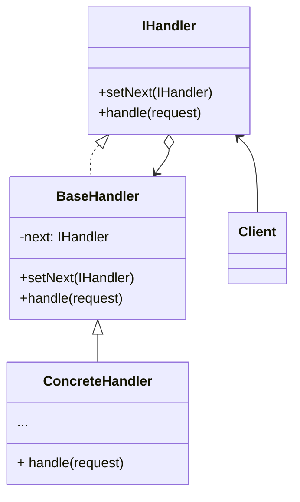

# SWD-Chain-of-Responsibility
Mandatory Assignment in the course Sofware Design

## Design
Class diagram of the general structure of a program implementing the chain of responsibility pattern. Example from [Refactoring Guru](https://refactoring.guru/design-patterns/chain-of-responsibility)

## Links
[Overleaf Project](https://www.overleaf.com/6841318976jnqgmtvpdhwb)

[Mermaid Documentation](https://mermaid-js.github.io/mermaid/#/)

[Refactoring Guru](https://refactoring.guru/design-patterns/chain-of-responsibility)
