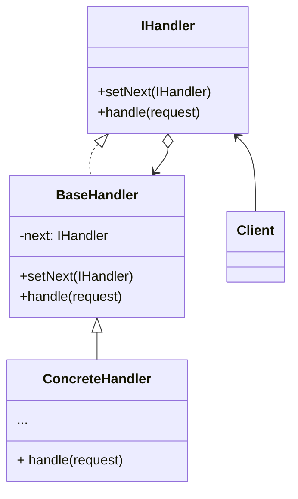
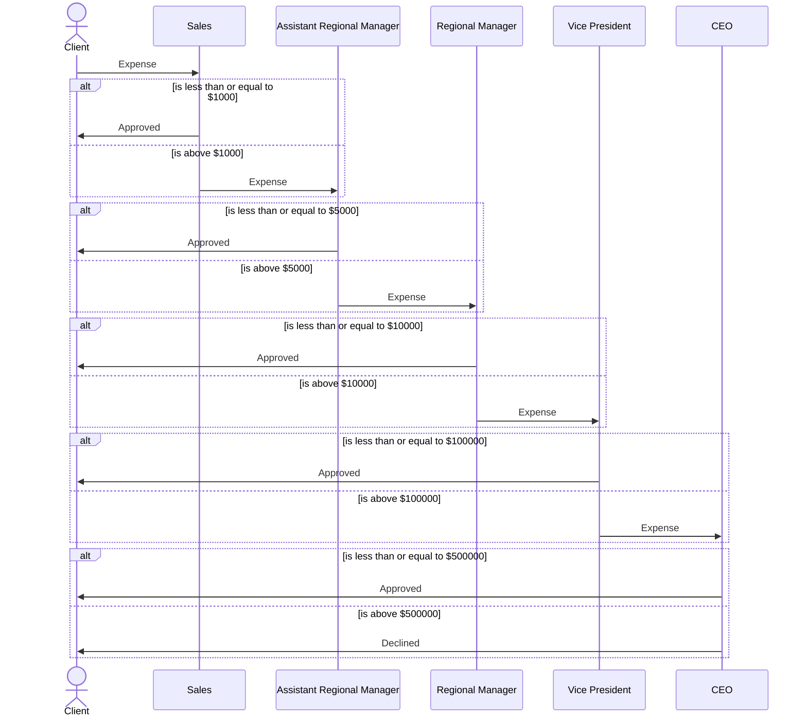

# SWD-Chain-of-Responsibility
Mandatory Assignment in the course Sofware Design

## Design
Class diagram of the general structure of a program implementing the chain of responsibility pattern. Example from [Refactoring Guru](https://refactoring.guru/design-patterns/chain-of-responsibility)

This repository includes an example of how the chain of responsibility pattern can be used to automate the process of approving or declining submitted expenses. 

The behavior we want will ensure that employees will only send the decision of approval over to their boss, if they are not authorized to do it themselves.

The following sequence diagram will illustrate this.

## Links
[Overleaf Project](https://www.overleaf.com/6841318976jnqgmtvpdhwb)

[Mermaid Documentation](https://mermaid-js.github.io/mermaid/#/)

[Refactoring Guru](https://refactoring.guru/design-patterns/chain-of-responsibility)
